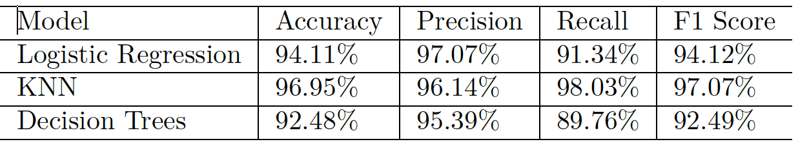

# Credit-Card-Fraud-Detection
This project will be implemented as a part of my current coursework - IDS 702 Modeling and Representation of Data

## Summary

Credit card companies must recognize fraudulent transactions to ensure that their customers are not charged for items that were not purchased by them. To avoid this, a model is being created that helps these companies identify fraudulent transactions. Since the data available is highly imbalanced, various techniques are used to adjust the class distribution of the data set before running classification models on the data. Recall is our most important indicator since we would rather detect regular transactions as fraudulent, instead of charging a customer for something they did not purchase. The most effective model has a recall of 98.03% on the test set (obtained after oversampling the data and splitting and train-test data) and 93.90% when tested on the entire data set.

## Introduction

The development of contactless payment systems, the growth of mobile technology, and the creation of Open Banking are slowing down the use of cash. As purchases migrate online, due to the higher volume of cashless transactions and more access points for the average consumer, there is an increased risk of crimes such as identity theft, account takeover, fraudulent transactions, and data breaches. Identity theft is one of the most common consequences of data breaches. According to Javelin, 31.7% of breach victims eventually suffered identity fraud in 2016 compared to just 2.8% of unaffected victims in 2016. The most common form of identity theft was credit card fraud (133,015 reports). This project aims to identify fraudulent transactions so that credit card users do not have to pay for items they did not purchase.

## Data

The data-set comprises transactions made in September 2013 by European credit cardholders. The data set has been collected and analysed during a research collaboration of Worldline and the Machine Learning Group (http://mlg.ulb.ac.be) of ULB (Université Libre de Bruxelles) on big data mining and fraud detection. This data-set contains two-day transaction details where 492 of 284,807 transactions were fraudulent. The data-set is highly imbalanced, with the positive category (fraud) accounting for 0.172% of all transactions.

Bar Plot             |  Pie Chart
:-------------------------:|:-------------------------:
 | 

Thie dataset has been sourced from kaggle: [https://www.kaggle.com/mlg-ulb/creditcardfraud](https://www.kaggle.com/mlg-ulb/creditcardfraud)

Numerical variables resulting from PCA (Principal Component Analysis) transformation are in the data-set. However, due to data privacy issues, the original features and more background information are not available. V1, V2...V28 are the key PCA components collected. The only features not transformed with PCA are ’Time’ and ’Amount.’ The ’Time’ feature includes the seconds from the first transaction in the data-set. The ’Amount’ feature is the payment amount used for cost-sensitive learning. ’Class’ is the response parameter, and in case of fraud, it takes value 1 and 0 otherwise. It is slightly difficult evaluate if there are any missing or erroneous values in this data-set since all variables have PCA transformed. A plot describing the distributions and correlation of all variables in the data-set is available in the appendix. The correlation matrix is not reliable due to the imbalance in the data set. The next pair of graphs explore the relationship of Amount with Class and Time.

Distribution of Amount with Class|  Distribution of Amount by Time
:-------------------------:|:-------------------------:
  |  

The first plot shows that high-value transactions are not fraudulent. Fraudulent transactions are of lower value. The fraudulent transactions amount have a mean of 122.21 ,whereas non-fraudulent transactions have a mean of 88.29. Despite having a higher mean value, the maximum amount spent during a fraudulent transaction is 2125.87 as compared to non-fraudulent transactions where the highest amount spent is 25691.16. This implies that fraudulent transactions are not very evident. A consumer may not even realize that their card is being used by someone else for a prolonged period due to the low value of transactions. The second plot demonstrates the relationship between Time and Amount classified on Class. Once again, it’s quite evident that the amount value of fraudulent transactions is fairly low as compared to non-fraudulent transactions. Also, there doesn’t seem to be a pattern based on time. A fraudulent transaction can occur anytime. So, the variable time is being excluded from this analysis. The graph below describes the distribution of one of the known variables, Amount. It is evident that amount is heavily skewed. Performing a log transformation on this variable creates a more normal distribution, which will be used throughout the analysis.

Amount Distribution (exp)|  Amount Distribution
:-------------------------:|:-------------------------:
  |  

The following analysis is based on the two techniques used to balance the data set. The first method used is Undersampling. Undersampling works by sampling the dominant class to reduce the number of samples. The method used here is selecting a few samples from the Fraudulent class randomly and using them with the non-fraudulent transactions in a new data set. A correlation matrix is available in the appendix. Class shows high positive correlation with V2, V4, V11 and high negative correlation with V14, V12, V10. The graph below shows an equal distribution in both classes along with a t-SNE plot. t-SNE (t-Distributed Stochastic
Neighbor Embedding) is a non-linear dimension reduction algorithm used to study high-dimensional data. It maps two or more dimensions of multi-dimensional data for analysis.

Class Distribution after Undersampling: 

Bar Plot|  t-SNE Plot
:-------------------------:|:-------------------------:
  |  

There are equal instances of fraudulent and non-fraudulent transactions. Also, clear clusters of fraudulent and non-fraudulent transactions are visible in the second graph. This suggests that the classification algorithms that will be used on this data will be able to segregate between the classes. A correlation matrix is available in the appendix. Class shows high positive correlation with V2, V4, V11 and high negative correlation with V14, V12, V10. A similar pair of graphs are visualized for the second method used to balance the data-set: Oversampling. Oversampling artificially creates observations in the data set belonging to the class that is underrepresented. The technique used to oversample is SMOTE (Synthetic Minority Over-sampling Technique). SMOTE creates synthetic observations of the minority class (in this case, fraudulent transactions). SMOTE finds the k-nearest-neighbors for minority class observations and randomly chooses one of the k-nearest-neighbors and using it to creates a similar, but randomly tweaked, new observations.

Bar Plot|  t-SNE Plot
:-------------------------:|:-------------------------:
  |  

There are equal instances of fraudulent and non-fraudulent transactions since the algorithm is tuned to created equal counts of both cases. There are a total of 1968 observations equally divided between fraudulent and non-fraudulent cases. Also, clear clusters of fraudulent and non-fraudulent transactions are visible in the second graph. This suggests that the classification algorithms that will be used on the data will be able to segregate between the two classes.

## Model

The undersampled and oversampled data-sets are split into training and testing data-sets using a 3:1 ratio that is 75 percent of data is used as training data and 25 percent as testing data. All models have been tested on the testing data-set as well as the entire data-set (original data-set). The test results are compared and a model is selected based on the highest Recall value. Recall is the most important evaluation metric in this case. This is because the requirement is to minimize false negatives. Recall is a model’s ability to find all the data points of interest in a data-set. The formula for recall is given below.

In this case the requirement is to identify fraudulent transactions (data points of interest) from the perspective of a credit card company. The cost of False Negatives (or a fraudulent transaction being categorized as a non-fraudulent transaction) is much higher than False Positives (categorizing a non-fraudulent transaction as a fraudulent one).

Even though Recall is used to evaluate these models, it is also interesting to observe Precision and F1-Score. There is a recall-precision trade-off. Precision expresses the proportion of positive identifications that are actually correct. F1 score is a combination of Precision and Recall.

Three classification algorithms (**Logistic Regression, K-nearest-neighbor and Decision Trees**) are used on the training sets obtained. The reasons behind picking these three modeling techniques are explained below:

**Logistic Regression** : The primary reason behind using this method is that it has been taught in class.
Apart from that, Logistic Regression is incredibly easy to implement and very efficient to train. Because of
its simplicity Logistic Regression is also a good baseline that can be use to measure the performance of other
more complicated Algorithms.

**K-nearest-neighbor** : KNN is a popular clustering algorithm because it is simple to implement, robust to noisy training data, and effective if training data is large.

**Decision Trees** : Decision trees can learn non-linear relationships, and are reasonably robust to outliers. Decision Tree is simple to visualize and requires little data preparation.

## Undersampling
The undersampled data-set consists of 984 observations. This is split into training and testing such that there are 738 observations in the training data set and 246 observations in the testing data set. All independent variables are used in the logistic model [apart from time as mentioned above] to predict the class. A table with the logistic regression output is given in the appendix. Since this model can help understand the impact of each variable on the final output it is a good idea to study it’s results. The model suggests that V2, V3, V13, V21 - V26, V28 and Amount as not significant. However, this is not an accurate representation in this case for two reasons. First of all, there is no description available for the given independent variables. Secondly, these variables are PCA transformed. It is unreasonable to drop them from the model. So, the final model involves all independent variables. The tables below show the confusion matrix of the test data set with 246 observations.

All three models seem to be able to classify fraudulent and non-fraudulent transactions effectively. The table below describes the evaluation metric used to validate the model.

KNN seems to perform best is this situation with the highest recall value of 95.12 percent. The next set of observations are made by testing the same models on the entire data-set that has imbalanced data points.

Decision tree performs poorly when tested on the entire data-set. Decision tree is a Greedy algorithm and hence cannot guarantee to return the globally optimal decision tree. Also, while working with continuous numerical variables, decision tree loses information, when it categorizes variables in different categories. It is possible that this model over-fits the training data and that wasn’t clearly visible in the test set due to lesser number of observations. However, on a larger data-set it’s evident that this model is not the best fit. A comparative study of the evaluation metrics will corroborate the results shown in the confusion matrix.

Logistic Regression and KNN have high Recall values which means that they are categorizing Fraudulent transactions quite effectively. Logistic Regression has lesser number of false negatives.

## Oversampling

The oversampled data-set consists of 1968 observations with equal instances of fraudulent and non-fraudulent transactions. This data-set is also split into training and testing such that there are 1476 observations in the training data set and 492 observations in testing data set.

The tables below show the confusion matrix of the test data set with 492 observations.

All three models seem to be able to classify fraudulent and non-fraudulent transactions quite effectively. KNN has the lowest number of false negatives. The table below describes the evaluation metric used to validate the model.

KNN seems to perform best is this situation with the highest recall value of 98.03 percent.
The next set of observations are made by testing the same model on the entire data-set that has imbalanceddata point.

Decision tree performs poorly even when trained on the oversampled data-set.

Logistic Regression and KNN have high Recall values which means that they are categorizing Fraudulent transactions quite effectively. However, the false positives are quite high.

## Conclusion

In conclusion, it is evident that KNN outperforms the other algorithms. Using an oversample data set and training it using KNN will produce the most desirable results. Although, KNN provides with a very high recall value and less number of false negatives it does not have a high precision value. A low precision value
indicates high number of false positives. False Positives can cause dissatisfaction for a customer who tends to use their cards often and the card is blocked by the credit card company whilst being falsely categorized in the incorrect category. Another, drawback is using sampled data. Undersampling may cause loss of important information and oversampling tends to over-fit. For future work, it would be interesting to find a way to have a high precision value along with a high recall value (high F1-score).

## Acknowledgements

- Andrea Dal Pozzolo, Olivier Caelen, Reid A. Johnson and Gianluca Bontempi. Calibrating Probability with Undersampling for Unbalanced Classification. In Symposium on Computational Intelligence and Data Mining (CIDM), IEEE, 2015
- Dal Pozzolo, Andrea; Caelen, Olivier; Le Borgne, Yann-Ael; Waterschoot, Serge; Bontempi, Gianluca. Learned lessons in credit card fraud detection from a practitioner perspective, Expert systems with applications,41,10,4915-4928,2014, Pergamon
- Dal Pozzolo, Andrea; Boracchi, Giacomo; Caelen, Olivier; Alippi, Cesare; Bontempi, Gianluca. Credit card fraud detection: a realistic modeling and a novel learning strategy, IEEE transactions on neural networks and learning systems,29,8,3784-3797,2018,IEEE
- Dal Pozzolo, Andrea Adaptive Machine learning for credit card fraud detection ULB MLG PhD thesis (supervised by G. Bontempi)
- Carcillo, Fabrizio; Dal Pozzolo, Andrea; Le Borgne, Yann-Aël; Caelen, Olivier; Mazzer, Yannis; Bontempi, Gianluca. Scarff: a scalable framework for streaming credit card fraud detection with Spark, Information fusion,41, 182-194,2018,Elsevier
- Carcillo, Fabrizio; Le Borgne, Yann-Aël; Caelen, Olivier; Bontempi, Gianluca. Streaming active learning strategies for real-life credit card fraud detection: assessment and visualization, International Journal of Data Science and Analytics, 5,4,285-300,2018,Springer International Publishing
- Bertrand Lebichot, Yann-Aël Le Borgne, Liyun He, Frederic Oblé, Gianluca Bontempi Deep-Learning Domain Adaptation Techniques for Credit Cards Fraud Detection, INNSBDDL 2019: Recent Advances in Big Data and Deep Learning, pp 78-88, 2019
- Fabrizio Carcillo, Yann-Aël Le Borgne, Olivier Caelen, Frederic Oblé, Gianluca Bontempi Combining Unsupervised and Supervised Learning in Credit Card Fraud Detection Information Sciences, 2019

## Appendix

